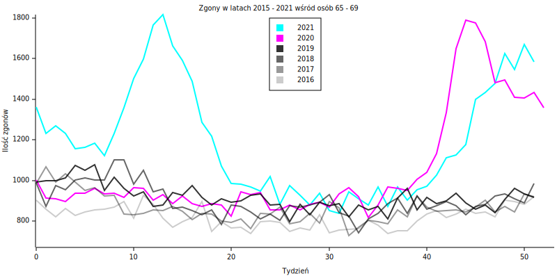

Główy Urząd Statystyczny na
[swojej stronie](https://stat.gov.pl/obszary-tematyczne/ludnosc/ludnosc/zgony-wedlug-tygodni,39,2.html)
publikuje statystyki zgonów z podziałem na wiek i obszar geograficzny.

Na podstawie tych danych można zbudować trójwymiarowy wykres przedstawiający
tygodniowe zgony od początku 2015 do końca 2021 w zależności od wieku.

Pierwszą charakterystyczną rzeczą są ekstrema wypadające na przełomie roku, czyli
dobrze znane "sezony grypowe". Dobrze widać również "dolinę" w ilości zgonów osób
około 75 roku życia. Jest ona spowodowana mniejszą ilośćią urodzeń podczas
II wojny światowej.

Z roku na rok wspomniany "dołek wojenny" wypełnia się, powodując, że liczba
zgonów w Polsce nieznacznie rośnie.

|                    | 2010 | 2011 | 2012 | 2013 | 2014 | 2015 | 2016 | 2017 | 2018 | 2019 | 2020 | 2021 |
|--------------------|------|------|------|------|------|------|------|------|------|------|------|------|
| średnia tygodniowa | 7263 | 7211 | 7345 | 7424 | 7216 | 7582 | 7441 | 7741 | 7910 | 7839 | 9162 | 9956 |

